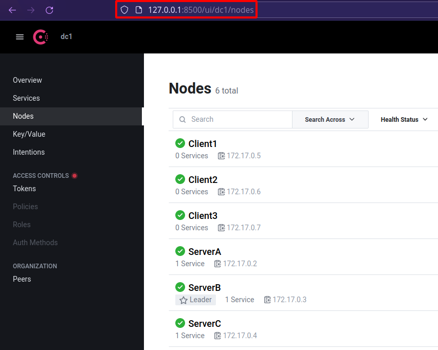

# consensusLockz

## Consul v.s. Redis

The reasons for using `Consul` to implement distributed locks

|     | Item | Redis                                | Consul                                                     |
| :--: | :------- | :------------------------------------ | :----------------------------------------------------------- |
| C  | Consistency | Use `RDB files` snapshots to maintain consistency | Fully implement `the Raft algorithm`                      |
| A  | High availability | Excellent performance, `a single node` can withstand high concurrency | The performance is not as good as Redis, so Goroutines must `be distributed on different nodes` to read data |
| P  | Partition tolerance  | Can only be `a single node`, single point of failure,no partition tolerance | Some nodes fail and still operate |

As long as it can be used for `service discovery`, `CP` is good enough. 

## Open Port

> [Official Documentation For The Ports](https://developer.hashicorp.com/consul/docs/install/ports)

Consul requires the following ports to be open:•Port Description• 

- **8300**: Read/write and replication of data within the cluster 
- **8301**: Gossip protocol communication within a single datacenter 
- **8302**: Gossip protocol communication between datacenters 
- **8500**: Provides HTTP API and UI service 
- **8600**: Provides DNS interface and service discovery

## Install Consus

[Official Documentation For Installation](https://developer.hashicorp.com/consul/downloads)

```bash
$ wget -O- https://apt.releases.hashicorp.com/gpg | sudo gpg --dearmor -o /usr/share/keyrings/hashicorp-archive-keyring.gpg

$ echo "deb [signed-by=/usr/share/keyrings/hashicorp-archive-keyring.gpg] https://apt.releases.hashicorp.com $(lsb_release -cs) main" | sudo tee /etc/apt/sources.list.d/hashicorp.list

$ sudo apt update && sudo apt install consul
```

## Quick Start

The following are the quick start commands

```bash
sudo -u consul consul agent -bind=X.X.X.X -bootstrap-expect=1 -data-dir=/opt/consul -server
```

Where X.X.X.X is the local IP and cannot be 0.0.0.0

## Start Systemd

First modify the configuration file

```bash
$ vim /etc/consul.d/consul.hcl

#bind_addr = "0.0.0.0" # Listen on all IPv4
bind_addr = "192.168.4.82" # Modify here !
```

Start systemd

```bash
$ systemctl start consul

$ systemctl status consul
# ● consul.service - "HashiCorp Consul - A service mesh solution"
#      Loaded: loaded (/lib/systemd/system/consul.service; disabled; vendor preset: enabled)
#      Active: active (running) since Sat 2023-06-10 20:01:19 CST; 57min ago
#        Docs: https://www.consul.io/
#    Main PID: 119968 (consul)
#       Tasks: 13 (limit: 38144)
#      Memory: 27.1M
#         CPU: 3.775s
#      CGroup: /system.slice/consul.service
#              └─119968 /usr/bin/consul agent -config-dir=/etc/consul.d/

$ systemctl stop consul

$ systemctl disable consul
```

Only one of the server component or client component can be started at a time.

It is very `inconvenient` to have systemd pass the `join` parameter.

It is better to test directly with Docker.

(systemd 要我如何设定 Json 啊)

## Standalone Container

Download the image file

```bash
$ docker pull consul
# Using default tag: latest
# latest: Pulling from library/consul
# Digest: sha256:4649f00e13177a5ace9620f5746abf6dd3cfb48b7828957e94db2f03616a780e
# Status: Image is up to date for consul:latest
# docker.io/library/consul:latest
```

Run single Consul

```bash
$ docker run --rm -it -p 8500:8500 --name=ConsulDevServer consul agent -dev -client=0.0.0.0
```

It provides a UI page

```bash
$ firefox 127.0.0.1:8500
```

## Container Cluster

Start Consul Cluster

```bash
$ docker run --rm -d -p 8500:8500 -p 8600:8600 --name=ConsulServerA consul agent -server -ui -node=ServerA -bootstrap-expect=3 -client=0.0.0.0

$ docker ps -a
# CONTAINER ID  IMAGE  COMMAND  CREATED  STATUS  PORTS  NAMES
# 5fa3798d473b   consul    "docker-entrypoint.s…"   24 seconds ago   Up 12 seconds   8301-8302/udp, 0.0.0.0:8500->8500/tcp, :::8500->8500/tcp, 8300-8302/tcp, 8600/udp, 0.0.0.0:8600->8600/tcp, :::8600->8600/tcp   ConsulServerA

# docker inspect 5fa3798d473b
# ...
# "IPAddress": "172.17.0.2",
# ...

$ docker run --rm -d -p 8501:8500 -p 8601:8600 --name=ConsulServerB consul agent -server -ui -node=ServerB -bootstrap-expect=3 -client=0.0.0.0 -join=172.17.0.2

$ docker run --rm -d -p 8502:8500 -p 8602:8600 --name=ConsulServerC consul agent -server -ui -node=ServerC -bootstrap-expect=3 -client=0.0.0.0 -join=172.17.0.2

$ docker run --rm -d -p 8503:8500 -p 8603:8600 --name=ConsulClient1 consul agent -node=Client1 -ui -client=0.0.0.0 -join=172.17.0.2

$ docker run --rm -d -p 8504:8500 -p 8604:8600 --name=ConsulClient2 consul agent -node=Client2 -ui -client=0.0.0.0 -join=172.17.0.2

$ docker run --rm -d -p 8505:8500 -p 8605:8600 --name=ConsulClient3 consul agent -node=Client3 -ui -client=0.0.0.0 -join=172.17.0.2
```

Open the Consul Cluster web page

 

[Consul Architecture Documentation ](https://developer.hashicorp.com/consul/docs/architecture)

## Shutdown Consul Cluster

Use the following commands to shutdown Consul Cluster

```bash
$ sudo docker stop $(sudo docker ps -aq --no-trunc -f ancestor=consul)
```

1. Consul的架構是什么?它由哪幾個部分組成?
   Consul由Server, Client, UI等幾个部分組成。
   Server負責存儲數據和處理查詢請求
   Client負責健康檢查和服務注册,UI提供웹頁界面進行操作。
2. Consul支援哪些服務發現模式?解释一下每种模式。
   Consul支援DNS查詢, HTTP API, DNS SRV記錄等多種服務發現模式。每种模式具有不同的應用場景和優缺點。
3. Consul的Consensus算法是什么?為什么選擇Raft算法?
   Consul使用Raft算法實現分布式一致性Consensus。Raft算法是一種便於理解和實現的分布式一致算法,可以在可變的系統拓撲中實現強一致性,這正是Consul server需要的特性,所以選擇了Raft算法。
4. Consul中Client到Server的RPC運行機制是怎樣的?
   Client和Server之間的RPC通信基於gRPC框架。Client會定期向Server註冊其提供的服務和健康信息。Server則回復該Client最新的配置和數據等信息。這樣Client和Server之間能夠保持強一致的數據信息。
